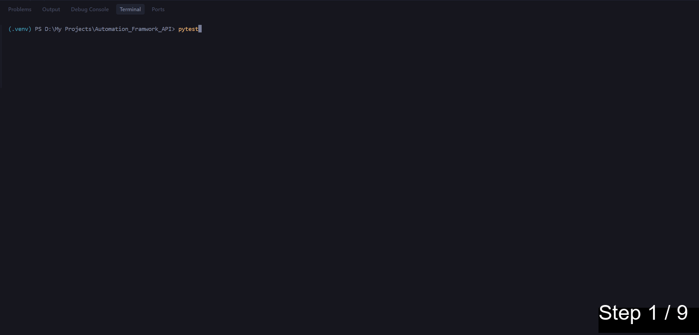

# Python API Automation Framework



A professional-grade API automation framework for [GoRest API](https://gorest.co.in/) built with **Python 3** and **Pytest**. This framework implements the **Service Object Pattern** to ensure scalability, maintainability, and clean separation of concerns.

## 🏗️ Architecture

The framework is structured into three main layers:

1.  **Core Layer** (`core/`):
    -   `api_client.py`: Base HTTP client wrapper around `requests`. Handles session management, request logging, and common headers.

2.  **Service Layer** (`services/`):
    -   `user_service.py`: Domain-specific service that encapsulates business logic for User endpoints (Create, Get, Delete). Inherits from `APIClient`.

3.  **Test Layer** (`tests/`):
    -   `test_users.py`: Contains test scenarios (positive, negative, end-to-end).
    -   `conftest.py`: Manages Pytest fixtures for authentication and service initialization.

### Project Structure

```text
Automation_Framework_API/
├── core/
│   └── api_client.py     # Base HTTP client
├── services/
│   └── user_service.py   # User domain logic
├── tests/
│   ├── conftest.py       # Fixtures & Setup
│   └── test_users.py     # User tests
├── data/
│   └── user_payloads.py  # Test data
├── .env                  # Secrets (Not committed)
├── pytest.ini            # Pytest configuration
├── requirements.txt      # Dependencies
└── README.md             # Documentation
```

## 🚀 Setup & Installation

### Prerequisites
-   Python 3.8+
-   Git

### 1. Clone the Repository
```bash
git clone <repository-url>
cd Automation_Framework_API
```

### 2. Create and Activate Virtual Environment
```bash
# Create virtual environment
python -m venv .venv

# Activate (Windows PowerShell)
.\.venv\Scripts\Activate

# Activate (Mac/Linux)
source .venv/bin/activate
```

### 3. Install Dependencies
```bash
pip install -r requirements.txt
```

### 4. Configure Environment Variables
The framework requires a GoRest Bearer Token to authenticate requests.

#### How to Obtain Your Token:
1.  Go to [GoRest.co.in](https://gorest.co.in/).
2.  Click on the **Login** link (top right) and log in using your Google, GitHub, or Microsoft account.
3.  After logging in, your unique **Access Token** will be displayed on the home page or dashboard.
4.  Copy this token.

#### Add Token to .env:
Create a `.env` file in the root directory and add the following line (replace with your actual token):

```properties
GOREST_TOKEN=your_actual_bearer_token_here
```
> **Security Note:** The `.env` file is excluded from git via `.gitignore` to keep your credentials safe.

## 🧪 Running Tests

### 1. Run All Tests
Execute the entire test suite:
```bash
pytest
```

### 2. Run by Test File
Run only tests in a specific file:
```bash
pytest tests/test_users_edge.py
```

### 3. Run by Test Name Keyword
Run tests that match a specific name (e.g., only "delete" tests):
```bash
pytest -k "delete"
```
Run tests excluding specific keywords:
```bash
pytest -k "not edge"
```

### 4. Run by Markers
Run tests marked as `smoke` or `regression` (if markers are applied to test functions):
```bash
pytest -m smoke
pytest -m regression
```

### 5. Run with Detailed Logs
To see real-time request/response logs in the console:
```bash
pytest -s
```

### 6. generate HTML Report
The report is automatically generated at `reports/report.html`. To open it:
- **Windows (PowerShell)**: `Invoke-Item reports/report.html`
- **Windows (CMD)**: `start reports/report.html`
- **Mac/Linux**: `open reports/report.html`

## 📝 Test Scenarios

-   **`test_create_user_success`**: Validates user creation with various valid payloads.
-   **`test_create_user_invalid_email`**: Ensures API handles invalid email formats correctly (422 Unprocessable Entity).
-   **`test_full_user_lifecycle`**: End-to-end user journey: Create -> Get -> Delete -> Verify Deletion (404).
-   **`test_update_user_name`**: Verifies that a user's properties can be successfully updated (200 OK).
-   **`test_get_non_existent_user`**: Confirms that requesting a non-existent user returns 404 Not Found.
-   **`test_create_user_missing_fields`**: Validates that required fields (name, email, gender, status) are enforced (422).

### Edge Case Tests (`tests/test_users_edge.py`)
-   **`test_create_user_duplicate_email`**: Verifies that creating a user with an already registered email returns 422.
-   **`test_create_user_invalid_gender`**: Tests strict enum validation for the 'gender' field (e.g., rejecting "batman").
-   **`test_create_user_max_length_fields`**: Tests system behavior when fields exceed standard lengths (boundary testing).
-   **`test_update_user_empty_body`**: Verifies that sending an empty update body is handled safely (idempotent).

## 📊 Logging

The framework includes built-in logging. Request and response details (URL, Method, Payload, Status, Body) are logged to the console during test execution when using the `-s` flag or if configured in `pytest.ini`.
